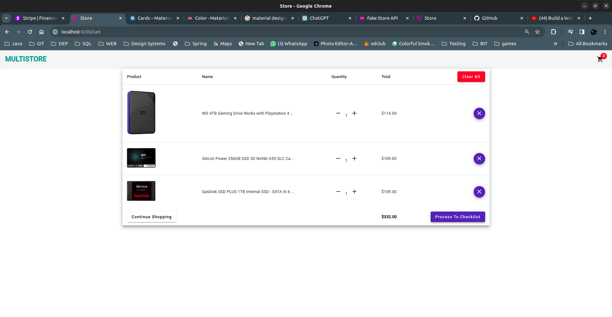

# Multi Store

Welcome to "Multi Store," a sophisticated web application designed for seamless online shopping experiences, built with Angular.
This project was generated with [Angular CLI](https://github.com/angular/angular-cli) version 17.0.3.

## Version
0.1.0
## License
Copyright & copy ;  2023 Isuru Ashinsana. All Rights Reserved. <br>
This project is licensed under the [MIT License](LICENSE.txt)

## Overview
- **Tech Stack:**
  - Angular for a dynamic and modular front-end.
  - Node.js & Express.js for a robust server-side performance.
  - Tailwind CSS for a modern and responsive UI.
  - Material Design principles for an intuitive and elegant interface.

- **Product Data:**
  - Utilizes the [Fakestore API](https://fakestoreapi.com/) for realistic product information.
- **Future Improvements**
  - Utilize Stripe to include transactions

## Getting Started

### Development server

Run `ng serve` for a dev server. Navigate to `http://localhost:4200/`. The application will automatically reload if you change any of the source files.

### Prerequisites
- Ensure Node.js is installed on your machine.
- Install Angular CLI globally:

### ScreenShots




### Setup

1. Clone the repository:
   ```bash
   https://github.com/IsuruAshi/#####
